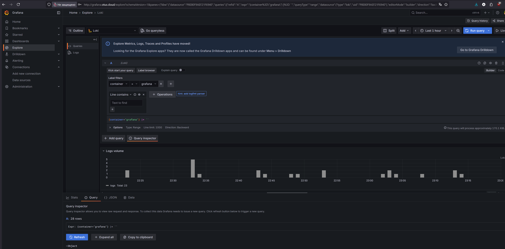
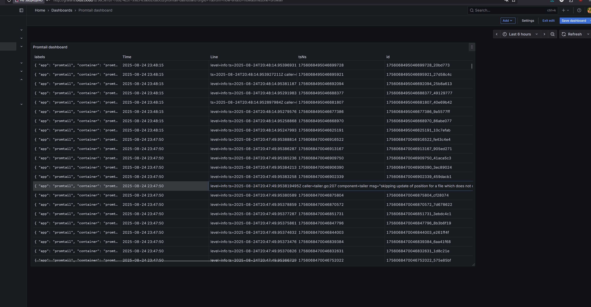
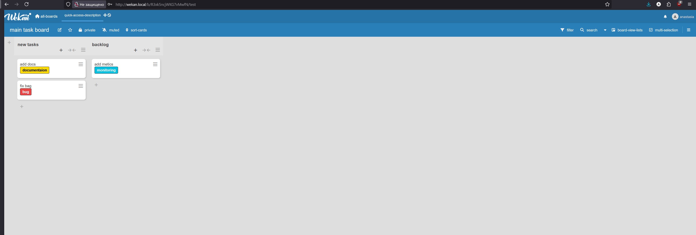

Требования 4/5 | Документация
Что вы сделали и как это повторить:
• README с описанием решения, changelog
• Шаги развертывания и настройки компонентов
• Описание интеграции с CI/CD-сервисом
• Подход к организации мониторинга и логирования
• Дополнительная информация про вашу платформу


# OTUS. Инфраструктурная платформа на основе Kubernetes. 23 апреля 2025 года — 3 сентября 2025
Задание: подготовка MVP инфраструктурной платформы для приложения-примера

МVP — это аббревиатура, которая расшифровывается как Minimum Viable Product (минимально жизнеспособный продукт).
Это начальная версия продукта, которая содержит только основные функции, необходимые для запуска на рынке и получения обратной связи от пользователей. Цель MVP — быстрее вывести продукт, минимизировать затраты на разработку и определить наиболее важные функции, которые ценят пользователи.

# Требования MVP платформы 
Обязательно включает в себя:
1. Kubernetes (managed или self-hosted)
2. Мониторинг кластера и приложения с алертами и дашбордами
3. Централизованное логирование для кластера и приложений
4. Обязательно в виде кода в репозитории:
    - Публичный
    - CI/CD пайплайн для приложения (Gitlab CI, Github Actions, etc)
5. Автоматизация создания и настройки кластера
6. Развертывание и настройки сервисов платформы
7. Настройки мониторинга, алерты, дашборды

# В качестве MPV выбрано:
- Managed Kubernetes кластер в Yandex Cloud
- Приложение Wekan (состоит из веб части и бд) #TODO подчеркнуть, что не успела 
- Мониторинг и логирование Loki-stack (Loki (хранение логов) + Grafana (визуализация) + promtail (сбор логов)) #TODO подчеркнуть что не успевала

# Предварительные требования
1. Необходимо создать сервисный аккаунт с ролями vpc.publicAdmin, container-registry.images.puller, k8s.cluster-api.cluster-admin, k8s.admin, load-balancer.admin, k8s.clusters.agent
2. Создать iam ключ для s3 с ролями storage.configViewer,storage.uploader
3. создать подсетку и группы безопасности
5. задать необходимые секреты в secrets в настройках репозитория
6. иметь локально установленную утилиту yc cli и далее ее же установить в github workflow

# Шаги развёртывания

Git workflow разбит на несколько этапов: 
1. развертывание кластера 
2. установка системных компонентов 
3. установка приложения 

## Развёртывание кластера
1. Для начала необходимо создать сам кластер: 
```
    yc managed-kubernetes cluster create  \
    --name ${{env.YC_CLUSTER_NAME}}  \
    --network-name ${{env.YC_NETWORK_NAME}} \
    --zone ru-central1-a  \
    --subnet-name  ${{env.YC_SUBNET_NAME}}   \
    --public-ip  \
    --service-account-name ${{secrets.YC_SA_KEY_NAME}} \
    --node-service-account-name ${{secrets.YC_SA_KEY_NAME}}`
```

обратим внимание, что часть значений (некритичных) задана в env переменных, часть в секретах. Так же важно обратить внимание, что кластер должен быть с публичным адресом для удобства дальнейшей работы и развёртывания.

2. Затем создать ноды, предварительно указав, все необходимые параметры для сети, кластера, групп безопасности
```
yc managed-kubernetes --folder-id=${{ secrets.YC_FOLDER_ID }} node-group create \
        --name ${{env.YC_NODE_GROUP}}  \
        --cluster-name  ${{env.YC_CLUSTER_NAME}} \
        --cores 4 \
        --memory 4 \
        --disk-type network-ssd \
        --fixed-size 1 \
        --disk-size 64 \
        --network-interface subnets=default-ru-central1-a,security-group-ids=enp6ink0ponebrv6uqui \
        --async
```

3. Далее надо получить креды для подключения к кластеру для выполнения дальнейшей работы
`yc managed-kubernetes cluster get-credentials ${{ env.YC_CLUSTER_NAME }} --external`

Основной этап завершён

## Конфигурирование инструментов 
1. для корректной работы необходимо заново получить креды для подключения к кластеру из предыдущего пункта последней командой
2. Далее производим установку loki: `helm install loki loki-distributed/ -f values/loki_values.yaml -n monitoring --create-namespace `
3. устанавливаем grafana, получаем креды для подключения и устанавливанием  promtail, для графаны сразу ставим ингресс 
```
helm install grafana ./grafana/ -f values/grafana_values.yaml -n monitoring
kubectl get secret --namespace logging loki-grafana -o jsonpath="{.data.admin-password}" | base64 --decode ; echo
kubectl apply -f ingress/grafana-ing.yaml
helm install promtail/ promtail -n monitoring
```


## Установка приложения
`helm upgrade --install wekan ./wekan -f ./wekan/values.yaml -n wekan --create-namespace`

# Описание приложения 
Wekan - open source task tracker.  Легковесное приложение, которое позволяет в целом выполнять все свои функции

# Проверка работоспособности 
Для получения доступа к веб интерфейсам необходимо прописать в /etc/hosts (linux/macos) или "C:\Windows\System32\drivers\etc\hosts" (windows)
```
84.201.145.154 grafana.otus.cloud
84.201.145.154 wekan.local
```

## Grafana:


 

## Wekan: 



Всё флоу описано в `.github/workflows/deploy.yml`, ingress для grafana - `ingress/grafana-ing.yaml`, чарты в репозитории. 

# Сложности: 
1. Не успела настроить алертинг+prometheus
2. Упорная проблема с loki, логи собираются частично и с wekan собрать не получается. Но джсонка для минимального дашика `dashboard.json`